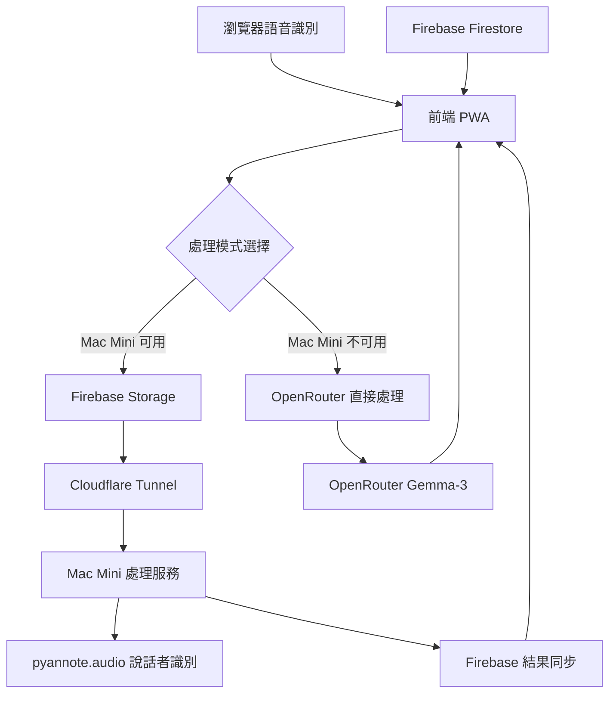

# 🎤 AI 會議工具 v2.0

> 專業級會議錄音、轉錄、說話者識別和 AI 分析工具
> 
> 整合 **OpenRouter**、**Firebase**、**Mac Mini 處理服務**和 **Cloudflare Tunnel** 的完整解決方案

[](https://github.com/garyyang1001/aplay-ai-meeting-tool/stargazers)
[](https://github.com/garyyang1001/aplay-ai-meeting-tool/blob/main/LICENSE)
[](https://github.com/garyyang1001/aplay-ai-meeting-tool/releases)

## ✨ 核心功能

### 🎯 **三層智能處理架構**
- **🌐 前端層**: 即時錄音、語音識別、結果展示
- **☁️ 雲端層**: Firebase 檔案存儲、狀態同步
- **🖥️ 邊緣層**: Mac Mini 專業音頻處理和說話者識別

### 🚀 **主要特色**
- ✅ **即時錄音轉錄** - 支援繁體中文和多語言
- ✅ **專業說話者識別** - 使用 pyannote.audio 3.1 模型
- ✅ **智能會議分析** - 整合 OpenRouter Gemma-3 模型
- ✅ **無縫雲端同步** - Firebase 自動備份和狀態管理
- ✅ **安全隧道連接** - Cloudflare Tunnel 零配置網路存取
- ✅ **容錯降級機制** - Mac Mini 離線時自動切換到純前端模式

### 📊 **分析功能**
- 📝 **會議摘要** - 自動生成重點整理
- ✅ **行動項目** - 提取具體任務和負責人
- 🎯 **重要決策** - 識別關鍵決策點
- 🤖 **智能分析** - 多維度會議洞察

---

## 🏗️ 系統架構



### 🔄 **處理流程**

1. **錄音階段**
   - 前端使用 MediaRecorder API 錄音
   - 同時進行瀏覽器語音識別
   - 即時顯示轉錄結果

2. **智能路由**
   - 檢查 Mac Mini 服務可用性
   - 根據狀態選擇處理路徑

3. **專業處理** (Mac Mini 可用時)
   - 上傳音頻到 Firebase Storage
   - 通知 Mac Mini 處理服務
   - 執行 pyannote 說話者識別
   - 對齊轉錄文字與說話者
   - 使用 OpenRouter 進行內容分析

4. **備用處理** (Mac Mini 不可用時)
   - 直接使用瀏覽器轉錄結果
   - 通過 OpenRouter 進行分析
   - 提供基本說話者模擬

---

## 🚀 快速開始

### 📋 **系統需求**

- **作業系統**: macOS 10.15+ / Ubuntu 18.04+ / Windows 10+ (WSL2)
- **Node.js**: v18.0.0 或更高版本
- **Python**: 3.8 或更高版本
- **記憶體**: 建議 8GB 以上 (Mac Mini 處理需要)
- **存儲**: 至少 5GB 可用空間
- **網路**: 穩定的網際網路連接

### ⚡ **一鍵安裝**

```bash
# 克隆專案
git clone https://github.com/garyyang1001/aplay-ai-meeting-tool.git
cd aplay-ai-meeting-tool

# 切換到最新分支
git checkout refactor/align-architecture-config

# 執行一鍵設置
chmod +x setup.sh
./setup.sh
```

設置腳本將自動：
- ✅ 檢查系統需求
- ✅ 安裝前端依賴
- ✅ 設置 Mac Mini 處理服務
- ✅ 配置 Cloudflare Tunnel
- ✅ 創建啟動腳本

### 🔧 **手動配置**

如果您偏好手動設置：

#### 1. **前端設置**
```bash
# 安裝依賴
npm install

# 複製環境配置
cp .env.example .env

# 編輯配置文件
nano .env
```

#### 2. **Mac Mini 服務設置**
```bash
cd mac-processor

# 創建 Python 虛擬環境
python3 -m venv venv
source venv/bin/activate

# 安裝依賴
pip install -r requirements.txt

# 設置環境配置
cp .env.example .env
nano .env  # 設置 HF_TOKEN
```

#### 3. **Cloudflare Tunnel 設置**
```bash
cd mac-processor

# 安裝 cloudflared
./tunnel.sh install

# 快速啟動（測試用）
./tunnel.sh quick

# 或設置持久 tunnel（生產用）
./tunnel.sh setup
```

---

## 🔑 必要配置

### 🤖 **OpenRouter API Key**
1. 訪問 [OpenRouter](https://openrouter.ai/)
2. 註冊帳號並獲取 API Key
3. 在 `.env` 文件中設置：
   ```bash
   VITE_OPENROUTER_API_KEY=your_api_key_here
   ```

### 🔥 **Firebase 配置**
1. 前往 [Firebase Console](https://console.firebase.google.com/)
2. 創建新專案或使用現有專案
3. 啟用 Storage 和 Firestore
4. 獲取配置信息並更新 `.env`:
   ```bash
   VITE_FIREBASE_API_KEY=your_api_key
   VITE_FIREBASE_PROJECT_ID=your_project_id
   # ... 其他 Firebase 配置
   ```

### 🤗 **Hugging Face Token**
1. 訪問 [Hugging Face](https://huggingface.co/settings/tokens)
2. 創建新的 Access Token
3. 接受模型使用條款：
   - [pyannote/speaker-diarization-3.1](https://huggingface.co/pyannote/speaker-diarization-3.1)
   - [pyannote/segmentation-3.0](https://huggingface.co/pyannote/segmentation-3.0)
4. 在 `mac-processor/.env` 中設置：
   ```bash
   HF_TOKEN=your_huggingface_token
   ```

---

## 🎮 使用方法

### 🚀 **啟動服務**

#### 方式一：一鍵啟動
```bash
./start_all.sh
```

#### 方式二：分別啟動
```bash
# 終端 1: 前端服務
./start_frontend.sh

# 終端 2: Mac Mini 處理服務
cd mac-processor && ./start.sh

# 終端 3: Cloudflare Tunnel
cd mac-processor && ./tunnel.sh quick
```

### 📱 **基本操作**

1. **開始錄音**
   - 訪問 http://localhost:5173
   - 點擊麥克風圖標
   - 授予麥克風權限
   - 開始講話

2. **即時轉錄**
   - 即時顯示語音轉文字
   - 支援繁體中文和多語言
   - 自動顯示時間戳記

3. **停止並分析**
   - 點擊停止按鈕
   - 選擇分析類型
   - 等待 AI 處理完成

4. **查看結果**
   - 瀏覽詳細的會議分析
   - 查看說話者分段
   - 分享或下載結果

### 🎯 **進階功能**

#### **說話者識別**
- 自動識別不同說話者
- 顯示說話時間分佈
- 支援 2-10 人會議

#### **智能分析類型**
- **會議摘要**: 重點內容整理
- **行動項目**: 任務和責任歸屬
- **重要決策**: 關鍵決策記錄
- **智能分析**: 全面多維度分析

#### **分享功能**
- 一鍵分享到 Line
- 複製到剪貼板
- 匯出 PDF 或文字檔

---

## 🔧 技術規格

### 🎨 **前端技術棧**
- **框架**: Vanilla TypeScript + Vite
- **UI**: HTML5 + CSS3 + Tailwind CSS
- **音頻**: MediaRecorder API + Web Speech API
- **雲端**: Firebase SDK v10.7.0
- **AI**: OpenRouter API 整合

### 🖥️ **Mac Mini 處理服務**
- **框架**: FastAPI + Python 3.8+
- **AI 模型**: pyannote.audio 3.1.1
- **深度學習**: PyTorch 2.0+
- **音頻處理**: librosa + soundfile
- **資料庫**: Firebase Firestore

### ☁️ **雲端服務**
- **檔案存儲**: Firebase Storage
- **資料庫**: Firebase Firestore
- **隧道服務**: Cloudflare Tunnel
- **AI 推理**: OpenRouter (Gemma-3-27b-it:free)

### 🔐 **安全性**
- **加密傳輸**: HTTPS/WSS 全程加密
- **隧道安全**: Cloudflare 邊緣網路保護
- **權限控制**: Firebase 安全規則
- **隱私保護**: 本地處理優先，雲端可選

---

## 📊 效能和成本

### ⚡ **效能指標**
- **錄音延遲**: < 100ms
- **轉錄延遲**: 即時 (瀏覽器) + 5-30秒 (增強)
- **說話者識別**: 30-120秒 (取決於音頻長度)
- **AI 分析**: 10-30秒
- **總處理時間**: 2-5分鐘 (10分鐘會議)

### 💰 **成本分析**
- **OpenRouter**: 免費額度 (Gemma-3)
- **Firebase**: 免費額度 (1GB 存儲, 50K 讀取)
- **Cloudflare Tunnel**: 完全免費
- **Mac Mini**: 電費約 $5-10/月
- **總成本**: $5-10/月

### 📈 **擴展性**
- **並發處理**: 支援多個同時會議
- **檔案大小**: 最大 2GB 音頻檔案
- **會議長度**: 無限制 (建議 < 2小時)
- **使用量**: Firebase 免費額度支援數百次會議

---

## 🐛 故障排除

### ❓ **常見問題**

#### **Q: Mac Mini 服務無法啟動**
**A**: 檢查以下項目：
- Python 虛擬環境是否啟動
- Hugging Face Token 是否正確設置
- 網路連接是否正常
- 依賴是否完整安裝

#### **Q: Cloudflare Tunnel 無法連接**
**A**: 嘗試以下解決方案：
- 檢查 cloudflared 是否正確安裝
- 確認本地服務 (port 8000) 正在運行
- 重新啟動 tunnel: `./tunnel.sh stop && ./tunnel.sh quick`

#### **Q: Firebase 權限錯誤**
**A**: 確認配置：
- API Key 是否正確
- Firebase 專案設置是否完整
- Storage 和 Firestore 規則是否允許讀寫

#### **Q: 音頻處理失敗**
**A**: 檢查原因：
- 音頻檔案是否損壞
- Mac Mini 服務日誌錯誤信息
- 嘗試重新錄音或上傳其他檔案

### 🔍 **調試方法**

#### **檢查服務狀態**
```bash
# 檢查前端
curl http://localhost:5173

# 檢查 Mac Mini 服務
curl http://localhost:8000/health

# 檢查 tunnel 狀態
cd mac-processor && ./tunnel.sh status
```

#### **查看日誌**
```bash
# Mac Mini 服務日誌
cd mac-processor && tail -f logs/app.log

# 瀏覽器開發者工具
# F12 -> Console 標籤
```

#### **重置環境**
```bash
# 清理 Node.js 環境
rm -rf node_modules package-lock.json
npm install

# 重置 Python 環境
cd mac-processor
rm -rf venv
python3 -m venv venv
source venv/bin/activate
pip install -r requirements.txt
```

---

## 🤝 貢獻指南

我們歡迎社群貢獻！請參考以下指南：

### 📝 **開發流程**
1. Fork 此專案
2. 創建功能分支 (`git checkout -b feature/amazing-feature`)
3. 提交更改 (`git commit -m 'Add amazing feature'`)
4. 推送到分支 (`git push origin feature/amazing-feature`)
5. 開啟 Pull Request

### 🧪 **測試要求**
- 前端：確保在主流瀏覽器測試
- 後端：包含單元測試和整合測試
- 文檔：更新相關說明文件

### 📋 **問題回報**
使用 [GitHub Issues](https://github.com/garyyang1001/aplay-ai-meeting-tool/issues) 回報：
- Bug 報告
- 功能請求
- 文檔改進建議

---

## 📄 授權條款

本專案使用 [MIT License](LICENSE) 授權。

---

## 🙏 致謝

感謝以下開源專案和服務：

- **[pyannote.audio](https://github.com/pyannote/pyannote-audio)** - 專業說話者識別
- **[OpenRouter](https://openrouter.ai/)** - AI 模型 API 服務
- **[Firebase](https://firebase.google.com/)** - 雲端基礎設施
- **[Cloudflare](https://cloudflare.com/)** - Tunnel 服務
- **[FastAPI](https://fastapi.tiangolo.com/)** - 現代 Python Web 框架
- **[Vite](https://vitejs.dev/)** - 快速前端建構工具

---

## 📞 聯絡方式

- **作者**: Gary Yang
- **GitHub**: [@garyyang1001](https://github.com/garyyang1001)
- **專案**: [aplay-ai-meeting-tool](https://github.com/garyyang1001/aplay-ai-meeting-tool)
- **問題反饋**: [Issues](https://github.com/garyyang1001/aplay-ai-meeting-tool/issues)

---

## 🚀 路線圖

### 📅 **v2.1 計畫功能**
- [ ] 支援更多語言模型 (Claude, GPT-4)
- [ ] 會議摘要 PDF 匯出
- [ ] 即時協作功能
- [ ] 進階說話者管理

### 📅 **v3.0 計畫功能**
- [ ] 移動應用 (React Native)
- [ ] 企業版功能
- [ ] API 開放平台
- [ ] 進階分析儀表板

---

<div align="center">

**🎤 開始您的智能會議體驗！**

[](https://github.com/garyyang1001/aplay-ai-meeting-tool)

</div>
