# 🖥️ Mac Mini 音頻處理服務

> 專業級音頻處理和說話者識別服務
> 
> 使用 **pyannote.audio 3.1** 提供高精度說話者識別功能

## 🎯 功能特色

- ✅ **專業說話者識別** - 使用 pyannote.audio 3.1.1 模型
- ✅ **多格式音頻支援** - 支援 WAV、MP3、WebM 等格式
- ✅ **RESTful API** - 完整的 FastAPI 接口
- ✅ **WebSocket 支援** - 即時音頻處理
- ✅ **Firebase 整合** - 自動同步處理結果
- ✅ **背景處理** - 非阻塞式異步處理
- ✅ **健康監控** - 完整的狀態檢查和日誌

## 🚀 快速開始

### 📋 系統需求

- **Python**: 3.8 或更高版本
- **記憶體**: 建議 8GB 以上
- **儲存**: 至少 5GB 可用空間（模型檔案）
- **網路**: 穩定網際網路連接（下載模型）

### ⚡ 快速安裝

```bash
# 進入 mac-processor 目錄
cd mac-processor

# 執行一鍵啟動腳本
chmod +x start.sh
./start.sh
```

### 🔧 手動安裝

```bash
# 1. 創建虛擬環境
python3 -m venv venv
source venv/bin/activate

# 2. 升級 pip
pip install --upgrade pip

# 3. 安裝依賴
pip install -r requirements.txt

# 4. 設置環境變數
cp .env.example .env
nano .env  # 設置必要的配置

# 5. 啟動服務
python main.py
```

## 🔑 環境配置

### 必要配置

複製 `.env.example` 到 `.env` 並設置以下變數：

```bash
# Hugging Face Token（必須）
HF_TOKEN=your_huggingface_token_here

# 服務配置
PORT=8000
HOST=0.0.0.0

# Firebase 配置（可選）
FIREBASE_CREDENTIALS_PATH=firebase-credentials.json
```

### Hugging Face 設置

1. **獲取 Token**
   - 訪問 [Hugging Face Settings](https://huggingface.co/settings/tokens)
   - 創建新的 Access Token

2. **接受模型條款**
   - [pyannote/speaker-diarization-3.1](https://huggingface.co/pyannote/speaker-diarization-3.1)
   - [pyannote/segmentation-3.0](https://huggingface.co/pyannote/segmentation-3.0)

3. **設置 Token**
   ```bash
   export HF_TOKEN=your_token_here
   # 或在 .env 文件中設置
   ```

## 🔗 Cloudflare Tunnel 設置

使用 Cloudflare Tunnel 讓前端能夠訪問 Mac Mini 服務：

### 快速設置

```bash
# 安裝 cloudflared
./tunnel.sh install

# 啟動快速 tunnel（測試用）
./tunnel.sh quick

# 複製輸出的 URL 到前端 .env 文件
```

### 持久設置

```bash
# 設置持久 tunnel
./tunnel.sh setup

# 啟動 tunnel
./tunnel.sh start
```

## 📡 API 參考

### 核心端點

#### `GET /`
健康檢查

```bash
curl http://localhost:8000/
```

#### `GET /health`
詳細健康檢查

```bash
curl http://localhost:8000/health
```

#### `POST /process`
處理音頻請求

```bash
curl -X POST http://localhost:8000/process \
  -H "Content-Type: application/json" \
  -d '{
    "job_id": "test-123",
    "audio_url": "https://example.com/audio.wav",
    "transcript": [],
    "num_speakers": 2
  }'
```

#### `GET /status/{job_id}`
查詢處理狀態

```bash
curl http://localhost:8000/status/test-123
```

#### `POST /upload`
直接上傳音頻檔案

```bash
curl -X POST http://localhost:8000/upload \
  -F "file=@audio.wav" \
  -F "num_speakers=2"
```

### WebSocket 端點

#### `WS /ws/process/{session_id}`
即時音頻處理

```javascript
const ws = new WebSocket('ws://localhost:8000/ws/process/session-123');

ws.onopen = () => {
  // 發送配置
  ws.send(JSON.stringify({
    type: 'config',
    data: { sample_rate: 16000 }
  }));
};

// 發送音頻數據
ws.send(audioBuffer);

// 接收處理結果
ws.onmessage = (event) => {
  const result = JSON.parse(event.data);
  console.log('處理結果:', result);
};
```

## 🏗️ 架構說明

### 服務組件

```
Mac Mini 處理服務
├── FastAPI Web 框架
├── pyannote.audio 核心
├── PyTorch 深度學習
├── Firebase 整合
└── 背景任務處理
```

### 處理流程

1. **接收請求**
   - REST API 或 WebSocket
   - 音頻 URL 或直接上傳

2. **音頻下載**
   - 從 Firebase Storage 下載
   - 音頻格式驗證

3. **說話者識別**
   - pyannote.audio 模型推理
   - 說話者分段和標記

4. **結果處理**
   - 轉錄對齊
   - 統計計算

5. **結果同步**
   - 更新 Firebase
   - 通知前端

### 資料流

```mermaid
graph LR
    A[前端請求] --> B[FastAPI 接收]
    B --> C[音頻下載]
    C --> D[pyannote 處理]
    D --> E[結果格式化]
    E --> F[Firebase 同步]
    F --> G[回傳前端]
```



## 📊 效能和優化

### 效能指標

- **初始載入**: 30-60秒（首次下載模型）
- **處理速度**: 約 0.5-2x 即時速度
- **記憶體使用**: 3-6GB（取決於音頻長度）
- **GPU 加速**: 支援 CUDA（如果可用）

### 優化建議

1. **硬體優化**
   ```bash
   # 啟用 GPU（如果可用）
   export CUDA_VISIBLE_DEVICES=0
   
   # 優化記憶體使用
   export PYTORCH_CUDA_ALLOC_CONF=max_split_size_mb:512
   ```

2. **模型快取**
   ```python
   # 模型會自動快取到 ~/.cache/torch/pyannote
   # 首次使用後啟動速度會顯著提升
   ```

3. **批次處理**
   ```bash
   # 設置背景工作程序
   export WORKER_PROCESSES=2
   ```

## 🐛 故障排除

### 常見問題

#### Q: 服務啟動失敗
**A**: 檢查以下項目：
- Python 版本是否正確（3.8+）
- 虛擬環境是否啟動
- 依賴是否完整安裝
- HF_TOKEN 是否設置

```bash
# 檢查 Python 版本
python3 --version

# 檢查虛擬環境
which python

# 重新安裝依賴
pip install --upgrade -r requirements.txt
```

#### Q: pyannote 模型載入失敗
**A**: 確認權限設置：
- HF_TOKEN 是否正確
- 是否接受模型使用條款
- 網路連接是否正常

```bash
# 測試 token
python -c "
from huggingface_hub import HfApi
api = HfApi(token='your_token')
print(api.whoami())
"

# 手動下載模型
python -c "
from pyannote.audio import Pipeline
Pipeline.from_pretrained('pyannote/speaker-diarization-3.1', use_auth_token='your_token')
"
```

#### Q: Firebase 連接失敗
**A**: 檢查配置：
- Firebase 憑證檔案是否存在
- 專案權限是否正確
- 網路防火牆設置

```bash
# 檢查 Firebase 憑證
ls -la firebase-credentials.json

# 測試 Firebase 連接
python -c "
import firebase_admin
from firebase_admin import credentials
cred = credentials.Certificate('firebase-credentials.json')
app = firebase_admin.initialize_app(cred)
print('Firebase 連接成功')
"
```

#### Q: Cloudflare Tunnel 無法連接
**A**: 故障排除步驟：
- 檢查本地服務是否運行
- 重新啟動 tunnel
- 檢查防火牆設置

```bash
# 檢查本地服務
curl http://localhost:8000/health

# 重啟 tunnel
./tunnel.sh stop
./tunnel.sh quick

# 檢查 tunnel 狀態
./tunnel.sh status
```

### 調試模式

啟用調試模式獲取更多信息：

```bash
# 設置調試級別
export LOG_LEVEL=DEBUG

# 啟動服務
python main.py
```

### 日誌查看

```bash
# 查看即時日誌
tail -f logs/app.log

# 查看錯誤日誌
grep ERROR logs/app.log

# 查看效能日誌
grep "processing time" logs/app.log
```

## 📈 監控和維護

### 健康檢查

```bash
# 自動健康檢查腳本
./scripts/health_check.sh

# 或手動檢查
curl -s http://localhost:8000/health | jq
```

### 效能監控

```bash
# 檢查記憶體使用
ps aux | grep python

# 檢查 GPU 使用（如果可用）
nvidia-smi

# 檢查磁碟空間
df -h
```

### 定期維護

```bash
# 清理臨時檔案
rm -rf temp/*.wav

# 清理舊日誌
find logs/ -name "*.log" -mtime +7 -delete

# 更新依賴
pip install --upgrade -r requirements.txt
```

## 🔐 安全性

### 網路安全
- 使用 HTTPS/WSS 加密傳輸
- Cloudflare Tunnel 提供額外保護
- 不直接暴露 IP 地址

### 資料安全
- 臨時檔案自動清理
- Firebase 安全規則
- API 請求驗證

### 權限管理
- 最小權限原則
- 環境變數保護敏感信息
- 定期更新 Token

## 🚀 開發和擴展

### 開發環境

```bash
# 安裝開發依賴
pip install pytest pytest-asyncio black flake8

# 運行測試
pytest tests/

# 代碼格式化
black main.py

# 代碼檢查
flake8 main.py
```

### 自定義配置

```python
# config.py
class Config:
    # 自定義模型參數
    DIARIZATION_PARAMS = {
        'min_speakers': 1,
        'max_speakers': 10,
        'clustering_threshold': 0.7
    }
    
    # 自定義處理參數
    PROCESSING_PARAMS = {
        'chunk_size': 30,  # 秒
        'overlap': 5,      # 秒
        'sample_rate': 16000
    }
```

### API 擴展

```python
# 添加自定義端點
@app.post("/custom/analyze")
async def custom_analyze(data: CustomRequest):
    # 自定義分析邏輯
    result = await custom_processing(data)
    return result
```

## 📞 技術支援

### 聯絡方式
- **專案 GitHub**: [aplay-ai-meeting-tool](https://github.com/garyyang1001/aplay-ai-meeting-tool)
- **問題回報**: [GitHub Issues](https://github.com/garyyang1001/aplay-ai-meeting-tool/issues)
- **功能請求**: [GitHub Discussions](https://github.com/garyyang1001/aplay-ai-meeting-tool/discussions)

### 相關資源
- **pyannote.audio 文檔**: [pyannote.github.io](https://pyannote.github.io/)
- **FastAPI 文檔**: [fastapi.tiangolo.com](https://fastapi.tiangolo.com/)
- **Cloudflare Tunnel**: [developers.cloudflare.com](https://developers.cloudflare.com/cloudflare-one/connections/connect-apps/)

---

<div align="center">

**🖥️ 專業級音頻處理，盡在 Mac Mini！**

</div>
